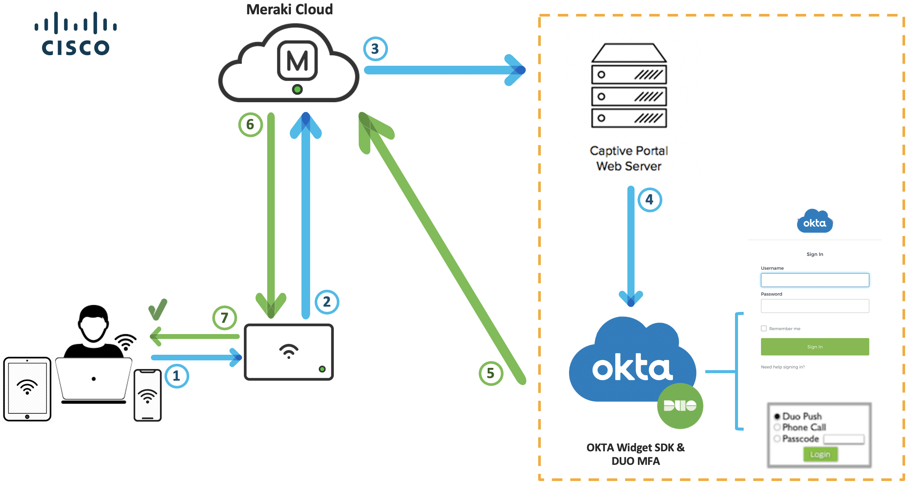
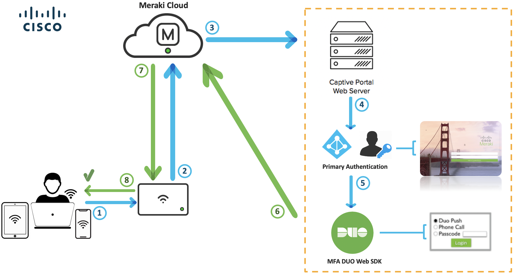

[](https://developer.cisco.com/codeexchange/github/repo/JPedro2/meraki-duo-integration)

# Meraki Duo Integration

## What is it?
An awesome _webapp_ that can be used as a [Meraki WiFi Captive Portal aka Splash Page](https://documentation.meraki.com/General_Administration/Cross-Platform_Content/Splash_Page). Capabilities include the ability to use [Okta SSO](https://www.okta.com/uk/products/single-sign-on/) or _your own authentication server_, enhanced with [Cisco DUO MFA](https://duo.com/product/multi-factor-authentication-mfa)!

Supported Features:

1. [Okta SSO Integration](https://developer.okta.com/docs/guides/build-sso-integration/saml2/overview/) with Okta as the _Authorization server_, using [OpenID Connect](https://openid.net/connect/)
2. Custom Authentication (Sample code includes [APRIL's Project Flask based API Authentication](https://github.com/JPedro2/WxT-QA-BOT/tree/master/backEnd))
3. [Cisco DUO Multi-factor Authentication](https://duo.com/docs#duo-mfa-features)
4. Fully customisable UI 
5. User logging
6. Container Support with Docker


## How does it work?
The Captive Portal utilises [Cisco Meraki Click-through Authentication](https://documentation.meraki.com/MR/MR_Splash_Page/Enabling_Click-through_splash-page) and a built-in authentication flow with _DUO MFA_ that authenticates the user, via _Okta SSO_ **or** via _Custom Authentication_, before serving the _Meraki URL_ that enables network access. If you want to see it in action, you can checkout this [30s YouTube video](https://youtu.be/vG7mbc4A3Tg).

The diagram below shows the splash page authentication flow when using _Okta SSO_ with _DUO_ MFA.

[](./docs/img/splash-page-okta-sso-auth-diagram.png)

The diagram below shows the splash page authentication flow when using a custom authentication service with _DUO_ MFA.

[](./docs/img/splash-page-custom-auth-diagram.png)

Please check here to [learn more about the Meraki Click-through API](https://developer.cisco.com/meraki/captive-portal-api/#!click-through-api).

## How do I deploy this?

Building this application couldn't be easier. There's two _awesome_ options:

1. Bare-metal/VM
2. Container 

### Setting the environment

The splash page _webapp_ that you are about to deploy has to be externally accessible, so if you are deploying this _On-Premise_ or in the _Cloud_ make sure that you have all your firewall rules setup for this. If you are deploying this **locally** in your machine, for testing purposes only, you can also use [ngrok](https://ngrok.com/) for exposing the _webapp_.

Before you deploy the application you need to set the `env` variables located in the [/env](./env/) folder.
For that you will need to have both a _DUO_ and a _Okta_ account, if you are using _Okta_.

### DUO Account Setup
1. Create a [30-Day Free Trial with DUO](https://signup.duo.com/) if you don't have an account already
2. Follow [Step 2 & 3 in this guide](https://duo.com/docs/duoweb-v2#first-steps) to create your application within your _DUO_ account. From here you will get your _DUO_ `integration key`, `secret key`, and `API hostname`
3. Generate your `akey` by following [Step 1 in this guide](https://duo.com/docs/duoweb-v2#1.-generate-an-akey)
4. [Enroll users](https://duo.com/docs/enrolling-users#manual-enrollment) to your _DUO Org_
5. Add the `ikey`, `skey`, `host` (from _Step 2_) and `akey` (from _Step 3_) to the [splashPageVariables.template](./env/splashPageVariables.template) file
6. Rename the `splashPageVariables.template` file as an `.env` file
   ``` bash
   cd env/
   mv splashPageVariables.template splashPageVariables.env
   cd ..
   ```

**Please note:** In this demo the _DUO Web SDKv2_ is used. If you wish to use the latest _DUO Web SDKv4_ you will need to [follow this guide to upgrade it from Web SDKv2](https://duo.com/docs/duoweb#upgrading-from-web-sdk-2).

### Okta Account Setup (optional)
1. Create a [free developer account](https://developer.okta.com/signup/), if you don't have an account already
2. Create your _Okta SSO_ integration by following [this guide](https://developer.okta.com/docs/guides/build-sso-integration/openidconnect/create-your-app/)
3. Select the _Application Type_ as `Web` and the _Grant Type_ as `Authorization Code` by following [this guide](https://developer.okta.com/docs/guides/build-sso-integration/openidconnect/specify-your-settings/)
4. Set the `Login redirect URI` to a webpage of your choice (doesn't matter which one)
5. Assign users to your _Okta Org_ by following [this guide](https://developer.okta.com/docs/guides/build-sso-integration/openidconnect/test-your-app/#assign-users)
6. Find the `baseUrlOKTA` [from here](https://developer.okta.com/docs/guides/build-sso-integration/openidconnect/test-your-app/#assign-users) and add it to the [splashPageVariables.env](./env/splashPageVariables.env) file
7. Add _DUO Security (MFA)_ integration to your _Okta_ application by following this [guide](https://help.okta.com/en/prod/Content/Topics/Security/Security_Duo.htm)

### Custom Authentication
If you are using a _3rd Party Authentication service_ **or** one that you have built, you will need to add the _base URL_ of that auth service to the `baseUrlAuth` variable in the [splashPageVariables.env](./env/splashPageVariables.env) file.


### Bare-metal/VM Deployment

1. Download the Repo into your local working directory
   ``` bash
   git clone https://github.com/JPedro2/meraki-duo-integration
   ```
2. [Download and Install Node.js](https://nodejs.org/en/). If you are on _macOS_, you can use [Homebrew](https://brew.sh/)
   ``` bash
   brew install node
   ```
3. Download and build all the required dependencies
   ``` bash
   cd meraki-duo-integration/customSplashPage/
   npm install
   npm run build
   ```
4. Start the webserver
   ``` bash
   npm start
   ```
5. You can confirm that the captive portal was sucessfully deployed by checking: 
   * [localhost:3006/signonokta](localhost:3006/signonokta) (_Okta_ SSO)
   * [localhost:3006/signon](localhost:3006/signon) (Custom Auth)

### Container Deployment

1. Download the Repo into your local working directory
   ``` bash
   git clone https://github.com/JPedro2/meraki-duo-integration
   ```
2. Run `docker-compose` to build the containerised application
   ``` bash
   cd meraki-duo-integration/
   docker-compose up -d --build
   ```
3. One of the _microservices_ deployed is an [NGINX](https://www.nginx.com/) container which is acting as a [reverse-proxy](https://docs.nginx.com/nginx/admin-guide/web-server/reverse-proxy/). You can confirm that the captive portal was sucessfully deployed by checking:
   * [localhost/signonokta](localhost/signonokta) (_Okta_ SSO)
   * [localhost/signon](localhost/signon) (Custom Auth)

### Meraki Setup

Once you have the _webapp_ running you will need to configure the _SSID_ of your _Meraki_ wireless network to support the splash page.
You will also need to setup the _Walled Garden_, which determines what network access the client has before authorization. This is critical for redirecting the client to the _webapp_, as well as the _DUO_ and _Okta_ authentication services.

1. In Meraki Dashboard, navigate to **Wireless > Access Control**
2. Choose the **SSID** you want to use from the drop-down list
3. Select **Open** in **Network Access**
4. Select **Click-through** in **Splash Page**
5. Set the **Captive portal strength** to **Block all access until sign-on is complete**
6. Set the **Walled garden** to **Walled garden is enabled**
7. In the **Walled garden ranges**, enter the following IP address ranges and domains:
   ``` bash
   <IP/Domain-of-the-Webapp-Deployed>
   *<your-Okta-domain>
   *.duo.com
   *.duosecurity.com
   *.duomobile.s3-us-west-1.amazonaws.com
   ```
8. Press **Save Changes** at the bottom of the screen
9. In Meraki Dashboard, navigate to **Wireless > Configure > Splash page**
10. In **Splash page**, choose the required SSID from the **SSID** drop-down list
11. Enter the full path to the Splash page _webapp_ deployed in the **Custom splash URL**
    * If you deployed with the Bare Metal/VM option: 
      * `<webapp-ip/domain>:3006/signonokta` - if you are using _Okta_ 
      * `<webapp-ip/domain>:3006/signon` - if you are using _Custom Auth_
    * If you deployed with the Container option:
      * `<webapp-ip/domain>/signonokta` - if you are using _Okta_ 
      * `<webapp-ip/domain>/signon` - if you are using _Custom Auth_
12. Press **Save Changes** at the bottom of the screen


## Authors & Maintainers

- [Pedro Oliveira](peolivei@cisco.com)
- [Josh Dean](joshudea@cisco.com)

## License

This project is licensed to you under the terms of the [Cisco Sample Code License](./LICENSE).